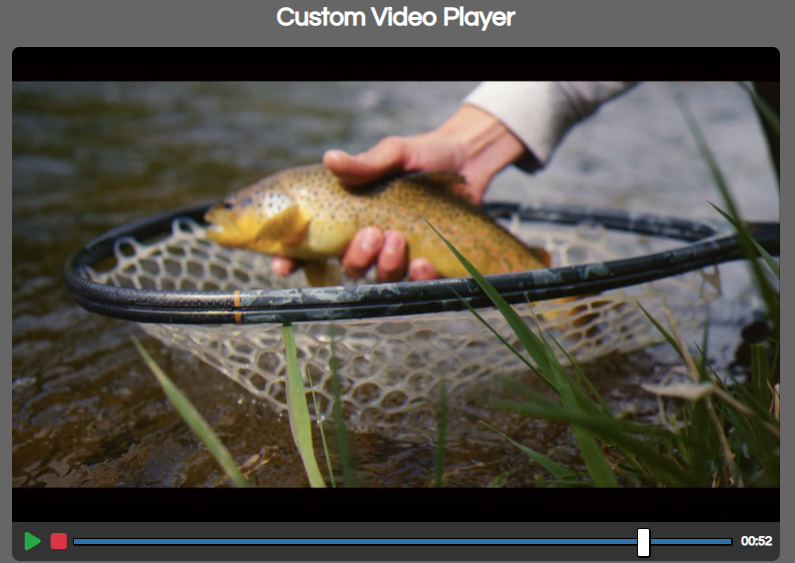

# Custom Video Player

A custom video player built using HTML5, CSS, and vanilla JavaScript. 

## Usage

1. Add the video file you want to play to the "video" folder.
2. Open the "index.html" file in your browser.
3. The video player should automatically load and play the video from the "video" folder.
4. You can also customize the look and feel of the player using the CSS file.

## Customization
- You can change the video to play by replacing the video file in the "video" folder.
- You can edit the CSS file to change the design of the player.
- You can also make changes to the JavaScript file to add additional functionality to the player.

## Note
- Make sure that the video file you want to play is in the correct format and is compatible with the browser you are using.
- The player uses the HTML5 `<video>` element and its associated properties, so it may not work on older browsers.

## Support
This player has been tested on the latest version of Chrome, Firefox, and Safari. If you encounter any issues or have any questions, feel free to open an issue on this repository.

## Credit
This project is inspired by Brad Traversy's course [20 Web Projects With Vanilla JavaScript](https://www.udemy.com/course/web-projects-with-vanilla-javascript/) 
